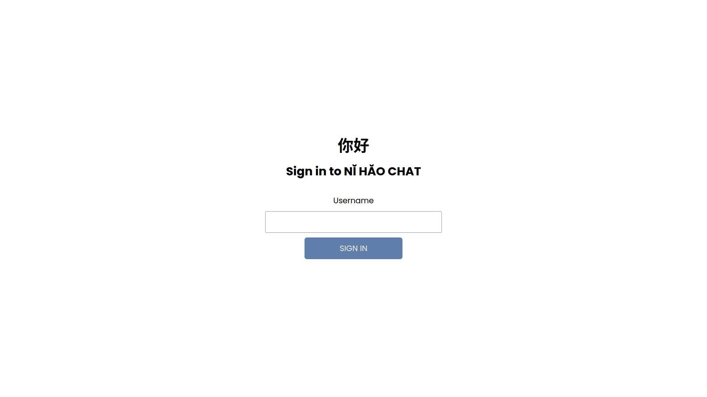
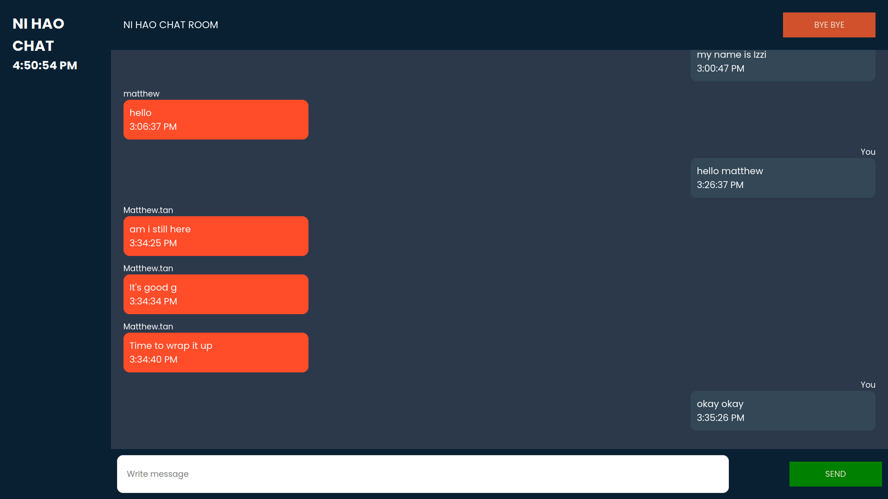

# NI HAO chat app

This project is intended to fulfill the 2022 Computer Network and Systems Lab group's final project.

- Matthew - 21/478240/PA/20736
- Fayza Anindita - 21/477466/PA/20668
- Izaaz Rahman Akbar - 21/472855/PA/20348
- Adam Rizki Pranabudi - 21/477431/PA/20662

In this final project, our primary objective is to implement the concept of socket programming in a real-world application. This project is influenced by a prevalent and widely known chat application, Whatsapp. Thus, We attempt to build a web-based chat application named “NĬ HĂO” by connecting multiple clients to a server. There will be sockets both on the server and the client's side. Our purpose is to allow users to conveniently communicate with their peers by sending and receiving messages through the local host server.

## Tech Stack

Thus, to achieve our final goal, we decided to write the program using the subsequent (Libraries & Frameworks):

**Client:** React, Socket.io-client, CSS

**Server:** Node, Express, Socket.io

## Installation

Clone the project to your local repository

```bash
git clone https://github.com/Easy1000/NI-HAO-chat-app.git
```

Go to project directory

```bash
cd NI-HAO-chat-app
```

Go to server directory and install the dependencies

```bash
cd server/
npm install
```

Go to client directory and install the dependencies

```bash
cd ..
cd client/
npm install
```

## Environment Variables

To run this project, you will need to add the following environment variables to your .env file

In client and server directory, create .env file and put your ip address into it

```bash
touch .env
```

Put the following information into both .env file
`REACT_APP_IP_ADDRESS = (your_ip_address)`

## Run The Program

Go to the project directory

```bash
cd NI-HAO-chat-app
```

Go to server directory and start the server

```bash
cd server/
npm start
```

Go to client directory and start the client server

```bash
cd ..
cd client/
npm start
```

After running the client, an http link should appear in the client terminal. Click on the link with the exact ip address, instead of the localhost. For example:

```bash
http://10.6.xxx.xx:3000
```

Copy the link and paste it on other computer's browser to let other client run the program from their browser.

## Changes and Improvements

We would like to express our appreciation towards our references for providing us the imperative insights on how to build our program. However, we would like to emphasize the differences and improvements done as we do not duplicate our references.

Consequently, the section below will discuss more on the changes and improvements made to make our program better, namely:

- We added a feature that directly removes the text in the text box after the message was sent. Hence, the users do not need to repeatedly remove their sent messages from the text box.
- We changed a major part of the web interface including the favicon, color palette, text field, and buttons using HTML and CSS.
- We provide a backend feature that enables us to store the message in the server. Hence, when new users enter the chat-room they are able to read the previous chats that had happened before.
- We added an auto-scroll feature that eases the convenience of our users. Hence, they do not need to scroll the page when it is already full of text.
- We added a feature that displays the current timestamp of when the message was sent. Hence, it provides a better timeline for communication.
- We put the ip address into environment variables so that the ip address is not hardcoded into the source code, for security measures
- We provide a feature that displays the current time.
- We eliminate unused files and redundant codes.

## Screenshots




## References

- [Everything you need to know about Socket.io](https://ably.com/topic/socketio#:~:text=Socket.IO%20allows%20bi%2Ddirectional,forms%2C%20JSON%20is%20the%20simplest)
- [Socket.IO chat example](https://socket.io/get-started/chat/)
- [Building a chat app with Socket.io and React](https://novu.co/blog/building-a-chat-app-with-socket-io-and-react/)
